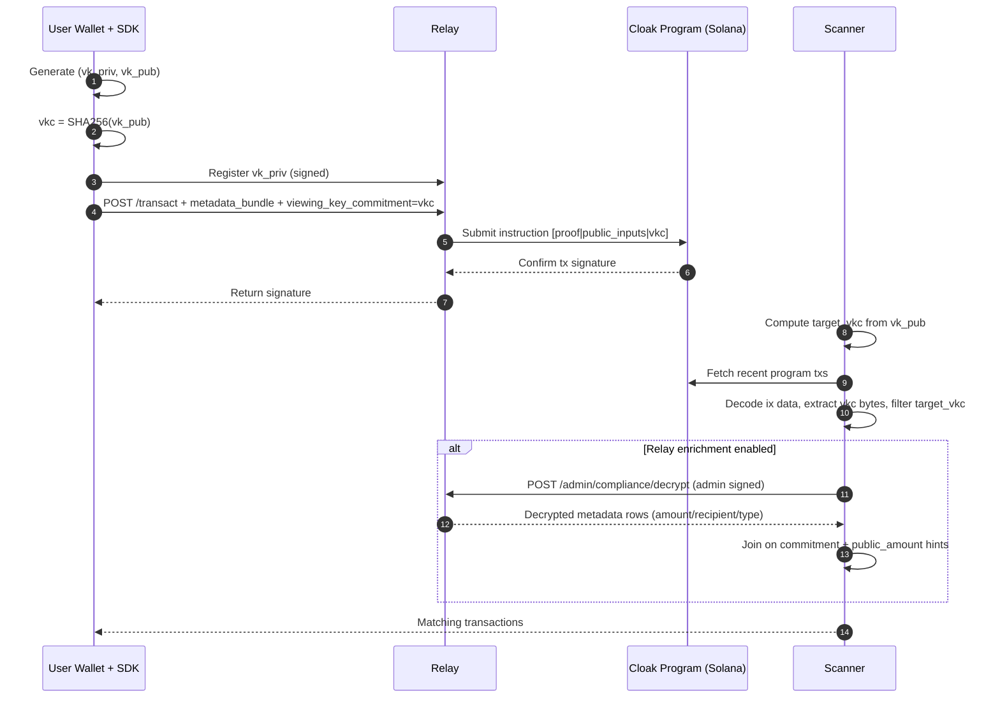

# @cloak.dev/sdk

TypeScript SDK for the Cloak Protocol - Private transactions on Solana using zero-knowledge proofs.

## Features

- 🔒 **Private Transfers**: Send SOL privately using zero-knowledge proofs
- 👥 **Multi-Recipient**: Support for 1-5 recipients in a single transaction
- 💱 **Token Swaps**: Swap SOL for SPL tokens privately (SOL → USDC, etc.)
- 🔐 **Type-Safe**: Full TypeScript support with comprehensive types
- 🌐 **Cross-Platform**: Works in browser (React, Next.js) and Node.js
- ⚡ **Simple API**: Easy-to-use high-level client with wallet adapter support

## Installation

```bash
npm install @cloak.dev/sdk @solana/web3.js
# or
yarn add @cloak.dev/sdk @solana/web3.js
# or
pnpm add @cloak.dev/sdk @solana/web3.js
```

**Note**: For swap functionality, you'll also need `@solana/spl-token`:
```bash
npm install @solana/spl-token
```

## Quick Start

### SDK Defaults (Recommended)

- Standard integrations should use SDK defaults for program, relay, and circuits.
- Do not expose protocol-level config (`programId`, relay URL, circuits URL) as end-user input.
- `transact`, `partialWithdraw`, and `fullWithdraw` already include stale-root retry handling.
- For simple CLI sends, require only `SOLANA_RPC_URL` and `KEYPAIR_PATH`.

### Minimal Private SOL Send (Single File, Keypair)

Use this contract for one-shot scripts and AI-generated snippets.

```ts
import { readFileSync } from "fs";
import {
  CLOAK_PROGRAM_ID,
  NATIVE_SOL_MINT,
  createUtxo,
  createZeroUtxo,
  fullWithdraw,
  generateUtxoKeypair,
  transact,
} from "@cloak.dev/sdk";
import { Connection, Keypair, PublicKey } from "@solana/web3.js";

async function main() {
  const [recipientArg, lamportsArg] = process.argv.slice(2);
  if (!recipientArg || !lamportsArg) {
    throw new Error("Usage: npx tsx send-sol-private.ts <recipientPubkey> <lamports>");
  }

  const rpcUrl = process.env.SOLANA_RPC_URL;
  const keypairPath = process.env.KEYPAIR_PATH;
  if (!rpcUrl || !keypairPath) {
    throw new Error("Set SOLANA_RPC_URL and KEYPAIR_PATH");
  }

  const connection = new Connection(rpcUrl, "confirmed");
  const signer = Keypair.fromSecretKey(
    Uint8Array.from(JSON.parse(readFileSync(keypairPath, "utf8"))),
  );

  const recipient = new PublicKey(recipientArg);
  const amountLamports = BigInt(lamportsArg);

  const owner = await generateUtxoKeypair();
  const output = await createUtxo(amountLamports, owner, NATIVE_SOL_MINT);

  const deposited = await transact(
    {
      inputUtxos: [await createZeroUtxo(NATIVE_SOL_MINT)],
      outputUtxos: [output],
      externalAmount: amountLamports,
      depositor: signer.publicKey,
    },
    {
      connection,
      programId: CLOAK_PROGRAM_ID,
      depositorKeypair: signer,
      walletPublicKey: signer.publicKey,
      enforceViewingKeyRegistration: false,
    },
  );

  const withdrawn = await fullWithdraw(deposited.outputUtxos, recipient, {
    connection,
    programId: CLOAK_PROGRAM_ID,
    depositorKeypair: signer,
    walletPublicKey: signer.publicKey,
    cachedMerkleTree: deposited.merkleTree,
    enforceViewingKeyRegistration: false,
  });

  console.log(withdrawn.signature);
}

main().catch((e) => {
  console.error(e instanceof Error ? e.message : String(e));
  process.exit(1);
});
```

Run:

```bash
SOLANA_RPC_URL="https://api.mainnet-beta.solana.com" \
KEYPAIR_PATH="/absolute/path/to/id.json" \
npx tsx send-sol-private.ts <recipientPubkey> <lamports>
```

Hard rules for minimal scripts:

- Use lamports from CLI (`<lamports>`) and keep transaction math in `bigint`.
- Use `KEYPAIR_PATH`; do not ask for raw private key env vars.
- Do not parse SOL decimals with float math (`parseFloat`, `AMOUNT_SOL`).
- Keep `programId` fixed to `CLOAK_PROGRAM_ID` (no end-user override).

### Maintained Examples

```bash
npm run example:fast-send
npm run example:fast-usdc-send
npm run example:usdc-pool-transfer
npm run example:swap
npm run example:swap-recovery
npm run example:swap-usdc
npm run example:swap-brz
npm run example:transfer
npm run test:examples
```

`example:transfer` runs deposit -> shield-to-shield transfer (`public_amount=0`) -> recipient withdraw verification and prints stable `FULL_SIG|transfer|deposit|...`, `FULL_SIG|transfer|tx|...`, and `COMMITMENT_INDICES|transfer|[...]` markers.

`example:fast-usdc-send` is the one-shot private send path for USDC recipients (deposit SOL, swap privately to USDC, deliver to recipient ATA).

`example:usdc-pool-transfer` is the mint-scoped USDC pool transfer path (User A deposits USDC into Cloak USDC pool, sends shielded USDC to User B, and User B spends the received shielded note).

`example:swap-usdc` is the canonical Nora swap evidence path (SOL -> USDC) and prints quote/route details, `FULL_SIG|swap-usdc|transact_swap|...`, `FULL_SIG|swap-usdc|swap_completed|...`, and `RECIPIENT_USDC_BALANCE|...` markers.

`example:swap-recovery` focuses on pending/timeout behavior. It submits a swap, tracks `swap_phase` + `slots_remaining` from relay `/status`, and can optionally call `close_timed_out` (`AUTO_CLOSE_TIMED_OUT=1`) once `can_recover=true`.

`example:swap-brz` first attempts BRZ (`FtgGSFADXBtroxq8VCausXRr2of47QBf5AS1NtZCu4GD`) and automatically falls back to USDC if BRZ routing is unavailable. It always emits `QUOTE_ROUTE|...`, `SWAP_OUTPUT_MINT|...`, and (when fallback happens) `BRZ_FALLBACK_TO|...`.

`test:examples` runs all maintained examples in `CLOAK_EXAMPLE_DRY_RUN=1` mode so CI/local checks validate script wiring without requiring funded wallets or live RPC execution.

### Node.js (with Keypair)

```typescript
import { CloakSDK } from "@cloak.dev/sdk";
import { Connection, Keypair, PublicKey } from "@solana/web3.js";

// Initialize connection and keypair
const connection = new Connection("https://api.devnet.solana.com");
const keypair = Keypair.fromSecretKey(/* your secret key */);

// Initialize SDK
const sdk = new CloakSDK({
  keypairBytes: keypair.secretKey,
  network: "devnet",
});

// Deposit SOL into the privacy pool
const depositResult = await sdk.deposit(connection, 100_000_000); // 0.1 SOL
console.log("Deposited! Leaf index:", depositResult.leafIndex);

// Withdraw to a recipient
const withdrawResult = await sdk.withdraw(
  connection,
  depositResult.note,
  new PublicKey("RECIPIENT_ADDRESS"),
  { withdrawAll: true }
);
console.log("Withdrawn! TX:", withdrawResult.signature);
```

### React/Next.js (with Wallet Adapter)

```typescript
import { CloakSDK } from "@cloak.dev/sdk";
import { useWallet, useConnection } from "@solana/wallet-adapter-react";
import { PublicKey } from "@solana/web3.js";

function PrivateTransfer() {
  const { publicKey, signTransaction, sendTransaction } = useWallet();
  const { connection } = useConnection();

  // Initialize SDK with wallet adapter
  const sdk = useMemo(() => {
    if (!publicKey) return null;
    return new CloakSDK({
      network: "devnet",
      wallet: {
        publicKey,
        signTransaction: (tx) => signTransaction!(tx),
        sendTransaction: (tx, conn, opts) => sendTransaction(tx, conn, opts),
      },
    });
  }, [publicKey, signTransaction, sendTransaction]);

  const handleDeposit = async () => {
    const result = await sdk.deposit(connection, 100_000_000);
    console.log("Deposited!", result.signature);
  };

  return <button onClick={handleDeposit}>Deposit 0.1 SOL</button>;
}
```

## Core Methods

### Deposit

Deposit SOL into the privacy pool:

```typescript
const result = await sdk.deposit(connection, 100_000_000); // 0.1 SOL
// Save the note securely - you need it to withdraw!
console.log(result.note);
```

### Withdraw

Withdraw to a single recipient:

```typescript
const result = await sdk.withdraw(
  connection,
  note,
  recipientPublicKey,
  { withdrawAll: true }
);
```

### Send to Multiple Recipients

Send to up to 5 recipients:

```typescript
const result = await sdk.send(connection, note, [
  { recipient: addr1, amount: 50_000_000 },
  { recipient: addr2, amount: 47_000_000 },
]);
```

### Swap

Swap SOL for SPL tokens:

```typescript
const result = await sdk.swap(connection, note, recipientPublicKey, {
  outputMint: "TOKEN_MINT_ADDRESS",
  minOutputAmount: 1000000,
});
```

## Fee Structure

- **Fixed Fee**: 0.005 SOL (5,000,000 lamports)
- **Variable Fee**: 0.3% of deposit amount

Use `getDistributableAmount()` to calculate the amount after fees:

```typescript
import { getDistributableAmount } from "@cloak.dev/sdk";

const deposited = 100_000_000; // 0.1 SOL
const afterFees = getDistributableAmount(deposited); // ~94,700,000 lamports
```

## Notes

A **Cloak Note** is a cryptographic commitment representing a private amount of SOL:

```typescript
interface CloakNote {
  version: string;
  amount: number;          // Amount in lamports
  commitment: string;      // Commitment hash
  sk_spend: string;        // Spending key (keep secret!)
  r: string;               // Randomness
  timestamp: number;
  network: Network;
  leafIndex?: number;      // Set after deposit
  depositSignature?: string;
}
```

**⚠️ Important**: Save your notes securely! Without the note, you cannot withdraw your funds.

## Compliance Chain Scanning

Cloak supports a viewing-key commitment flow for compliance and self-discovery:

- The viewing key itself is never written on-chain.
- Only `viewing_key_commitment = SHA256(viewing_key_public)` is stored on-chain.
- A scanner recomputes this commitment from `viewing_key_public` and matches program transactions.



## Error Handling

```typescript
import { CloakError } from "@cloak.dev/sdk";

try {
  await sdk.withdraw(connection, note, recipient);
} catch (error) {
  if (error instanceof CloakError) {
    console.log("Category:", error.category); // 'wallet', 'network', 'prover', etc.
    console.log("Retryable:", error.retryable);
  }
}
```

## Links

- Website: [https://cloak.ag](https://cloak.ag)
- Documentation: [https://docs.cloak.ag](https://docs.cloak.ag)
- GitHub: [https://github.com/cloak-ag/sdk](https://github.com/cloak-ag/sdk)

## License

Apache-2.0
